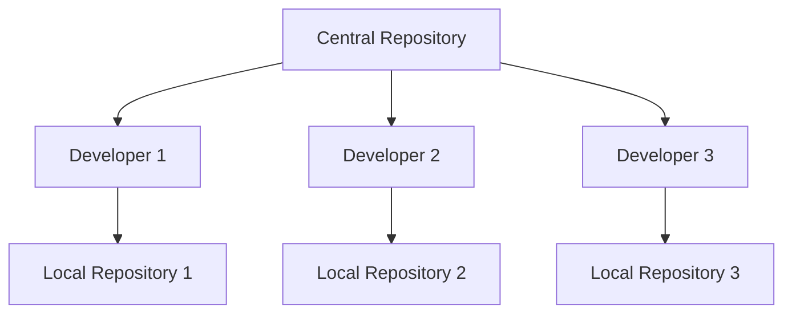
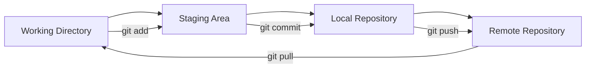
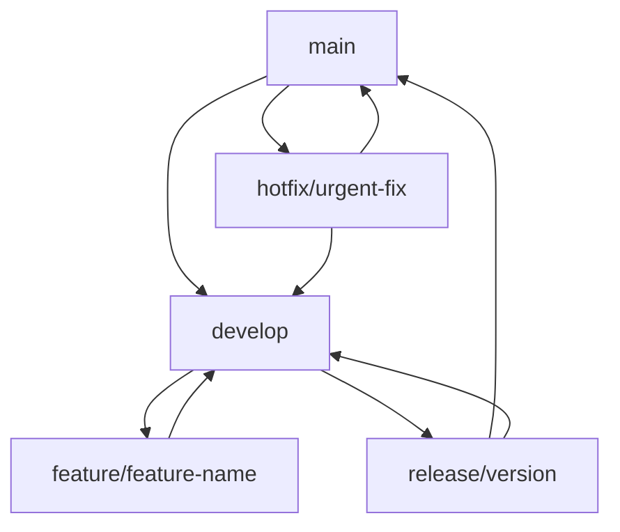

# Git & GitHub Master Notes By Deepak Modi

## Table of Contents

1. [Introduction to Git & GitHub](#1-introduction-to-git--github)

   - [1.1 What is Git?](#11-what-is-git)
   - [1.2 What is GitHub?](#12-what-is-github)
   - [1.3 Git vs GitHub](#13-git-vs-github)
   - [1.4 Version Control Systems](#14-version-control-systems)

2. [Git Installation & Setup](#2-git-installation--setup)

   - [2.1 Installing Git](#21-installing-git)
   - [2.2 Git Configuration](#22-git-configuration)
   - [2.3 GitHub Account Setup](#23-github-account-setup)
   - [2.4 SSH Key Setup](#24-ssh-key-setup)

3. [Git Fundamentals](#3-git-fundamentals)

   - [3.1 Git Repository](#31-git-repository)
   - [3.2 Git Workflow](#32-git-workflow)
   - [3.3 Git States](#33-git-states)
   - [3.4 Basic Git Commands](#34-basic-git-commands)

4. [Working with Files](#4-working-with-files)

   - [4.1 Adding Files](#41-adding-files)
   - [4.2 Committing Changes](#42-committing-changes)
   - [4.3 Viewing Changes](#43-viewing-changes)
   - [4.4 Undoing Changes](#44-undoing-changes)

5. [Branching & Merging](#5-branching--merging)

   - [5.1 Creating Branches](#51-creating-branches)
   - [5.2 Switching Branches](#52-switching-branches)
   - [5.3 Merging Branches](#53-merging-branches)
   - [5.4 Branch Management](#54-branch-management)

6. [Remote Repositories](#6-remote-repositories)

   - [6.1 GitHub Repository](#61-github-repository)
   - [6.2 Remote Operations](#62-remote-operations)
   - [6.3 Cloning Repositories](#63-cloning-repositories)
   - [6.4 Fetching & Pulling](#64-fetching--pulling)

7. [Collaboration & Workflows](#7-collaboration--workflows)

   - [7.1 Forking & Pull Requests](#71-forking--pull-requests)
   - [7.2 Code Review Process](#72-code-review-process)
   - [7.3 Issue Management](#73-issue-management)
   - [7.4 Team Workflows](#74-team-workflows)

8. [Advanced Git Topics](#8-advanced-git-topics)

   - [8.1 Git Hooks](#81-git-hooks)
   - [8.2 Git Aliases](#82-git-aliases)
   - [8.3 Git Stash](#83-git-stash)
   - [8.4 Git Rebase](#84-git-rebase)

9. [GitHub Features](#9-github-features)

   - [9.1 GitHub Pages](#91-github-pages)
   - [9.2 GitHub Actions](#92-github-actions)
   - [9.3 GitHub Packages](#93-github-packages)
   - [9.4 GitHub Security](#94-github-security)

10. [Best Practices & Troubleshooting](#10-best-practices--troubleshooting)
    - [10.1 Git Best Practices](#101-git-best-practices)
    - [10.2 Common Issues](#102-common-issues)
    - [10.3 Git Workflow Strategies](#103-git-workflow-strategies)
    - [10.4 Performance Optimization](#104-performance-optimization)

---

## 1. Introduction to Git & GitHub

### 1.1 What is Git?

Git is a distributed version control system designed to handle everything from small to very large projects with speed and efficiency. Created by Linus Torvalds in 2005, Git has become the standard for version control in software development.

#### Key Features of Git:

- **Distributed**: Every developer has a complete copy of the project history
- **Fast**: Most operations are performed locally
- **Secure**: Uses SHA-1 hashing to ensure data integrity
- **Flexible**: Supports various workflows and branching strategies
- **Free & Open Source**: Available for all platforms

#### Why Use Git?

- **Track Changes**: See what changed, when, and by whom
- **Collaborate**: Multiple developers can work on the same project
- **Backup**: Complete history of your project
- **Branching**: Work on features without affecting main code
- **Rollback**: Easily revert to previous versions

### 1.2 What is GitHub?

GitHub is a web-based platform that provides hosting for software development and version control using Git. It offers distributed version control and source code management functionality, plus its own features.

#### GitHub Features:

- **Repository Hosting**: Store your Git repositories in the cloud
- **Collaboration Tools**: Issues, pull requests, and project boards
- **CI/CD**: GitHub Actions for automation
- **Documentation**: Built-in wiki and README support
- **Social Coding**: Follow projects and developers

#### GitHub Benefits:

- **Free Public Repositories**: Open source projects at no cost
- **Private Repositories**: Secure storage for proprietary code
- **Integration**: Works with popular development tools
- **Community**: Large ecosystem of developers and projects
- **Enterprise Features**: Advanced security and compliance tools

### 1.3 Git vs GitHub

| Feature           | Git                    | GitHub                       |
| ----------------- | ---------------------- | ---------------------------- |
| **Type**          | Version Control System | Web-based Git Hosting        |
| **Installation**  | Local software         | Web service                  |
| **Storage**       | Local repositories     | Cloud repositories           |
| **Collaboration** | Basic (via remotes)    | Advanced (PRs, issues, etc.) |
| **Cost**          | Free                   | Free + Paid plans            |
| **Offline**       | Fully functional       | Requires internet            |

### 1.4 Version Control Systems

#### Types of Version Control:

1. **Local Version Control**

   - Simple database that keeps all changes to files under revision control
   - Example: RCS (Revision Control System)

2. **Centralized Version Control**

   - Single server contains all versioned files
   - Examples: CVS, Subversion (SVN)
   - **Problem**: Single point of failure

3. **Distributed Version Control**
   - Clients fully mirror the repository
   - Examples: Git, Mercurial, Bazaar
   - **Advantage**: No single point of failure

#### Git's Distributed Model:



## 2. Git Installation & Setup

### 2.1 Installing Git

#### Windows Installation:

1. **Download Git for Windows**

   - Visit: https://git-scm.com/download/win
   - Download the latest version
   - Run the installer with default settings

2. **Verify Installation**
   ```bash
   git --version
   ```

#### macOS Installation:

1. **Using Homebrew (Recommended)**

   ```bash
   brew install git
   ```

2. **Using Xcode Command Line Tools**

   ```bash
   xcode-select --install
   ```

3. **Download from Git Website**
   - Visit: https://git-scm.com/download/mac

#### Linux Installation:

1. **Ubuntu/Debian**

   ```bash
   sudo apt update
   sudo apt install git
   ```

2. **CentOS/RHEL/Fedora**

   ```bash
   sudo yum install git
   # or for newer versions
   sudo dnf install git
   ```

3. **Arch Linux**
   ```bash
   sudo pacman -S git
   ```

### 2.2 Git Configuration

#### Global Configuration:

```bash
# Set your name and email (used in commits)
git config --global user.name "Deepak Modi"
git config --global user.email "deepak@example.com"

# Set default editor
git config --global core.editor "code --wait"  # VS Code
git config --global core.editor "vim"          # Vim
git config --global core.editor "nano"         # Nano

# Set default branch name
git config --global init.defaultBranch main

# Enable colored output
git config --global color.ui auto

# Set line ending preferences
git config --global core.autocrlf true   # Windows
git config --global core.autocrlf input  # macOS/Linux
```

#### Local Configuration (Repository-specific):

```bash
# Set configuration for current repository only
git config user.name "Project Specific Name"
git config user.email "project@example.com"
```

#### View Configuration:

```bash
# View all configuration
git config --list

# View specific configuration
git config user.name
git config user.email

# View configuration with source
git config --list --show-origin
```

### 2.3 GitHub Account Setup

#### Creating GitHub Account:

1. **Sign Up**

   - Visit: https://github.com
   - Click "Sign up"
   - Choose username, email, and password
   - Verify email address

2. **Complete Profile**
   - Add profile picture
   - Write bio
   - Add location and website
   - Set status (public/private)

#### GitHub Settings:

1. **Account Settings**

   - Profile information
   - Email preferences
   - Security settings
   - Two-factor authentication

2. **Repository Settings**
   - Default repository settings
   - Branch protection rules
   - Webhook configurations

### 2.4 SSH Key Setup

#### Generate SSH Key:

```bash
# Generate new SSH key
ssh-keygen -t ed25519 -C "your_email@example.com"

# For older systems, use RSA
ssh-keygen -t rsa -b 4096 -C "your_email@example.com"

# Save to default location (~/.ssh/id_ed25519)
# Enter passphrase (optional but recommended)
```

#### Add SSH Key to SSH Agent:

```bash
# Start SSH agent
eval "$(ssh-agent -s)"

# Add SSH key to agent
ssh-add ~/.ssh/id_ed25519
```

#### Add SSH Key to GitHub:

1. **Copy Public Key**

   ```bash
   # Copy public key to clipboard
   cat ~/.ssh/id_ed25519.pub
   ```

2. **Add to GitHub**
   - Go to GitHub Settings → SSH and GPG keys
   - Click "New SSH key"
   - Paste public key
   - Give it a descriptive title
   - Click "Add SSH key"

#### Test SSH Connection:

```bash
# Test connection to GitHub
ssh -T git@github.com

# Should return: Hi username! You've successfully authenticated...
```

## 3. Git Fundamentals

### 3.1 Git Repository

#### What is a Repository?

A Git repository is a collection of files and folders that are tracked by Git. It contains:

- **Working Directory**: Your project files
- **Staging Area**: Files ready to be committed
- **Git Directory**: Complete history and metadata

#### Repository Structure:

```
my-project/
├── .git/                 # Git directory (hidden)
│   ├── objects/         # Git objects
│   ├── refs/           # References (branches, tags)
│   ├── config          # Repository configuration
│   └── HEAD            # Current branch reference
├── src/                # Source code
├── docs/               # Documentation
├── README.md           # Project description
└── .gitignore          # Files to ignore
```

### 3.2 Git Workflow

#### Basic Git Workflow:



#### Three States of Files:

1. **Modified**: File has been changed but not staged
2. **Staged**: File has been marked for next commit
3. **Committed**: File has been saved to local repository

### 3.3 Git States

#### File States in Git:

```bash
# Check file status
git status

# Output example:
# On branch main
# Changes to be committed:
#   (use "git restore --staged <file>..." to unstage)
#         modified:   README.md
#
# Changes not staged for commit:
#   (use "git add <file>..." to update what will be committed)
#         modified:   src/app.js
#
# Untracked files:
#   (use "git add <file>..." to include in what will be committed)
#         new-file.txt
```

#### Understanding Git Status:

- **Untracked**: New files not yet added to Git
- **Modified**: Existing files that have been changed
- **Staged**: Files added to staging area with `git add`
- **Committed**: Files saved to repository with `git commit`

### 3.4 Basic Git Commands

#### Repository Commands:

```bash
# Initialize new repository
git init

# Clone existing repository
git clone <repository-url>
git clone https://github.com/username/repo.git
git clone git@github.com:username/repo.git  # SSH

# Check repository status
git status

# View commit history
git log
git log --oneline          # Compact view
git log --graph            # Show branch graph
git log --all --graph      # Show all branches
```

#### Information Commands:

```bash
# Show current branch
git branch

# Show remote repositories
git remote -v

# Show configuration
git config --list

# Show help
git help <command>
git <command> --help
```

## 4. Working with Files

### 4.1 Adding Files

#### Adding Files to Staging:

```bash
# Add specific file
git add filename.txt

# Add all files in current directory
git add .

# Add all files in project
git add -A

# Add files matching pattern
git add *.js
git add src/

# Add files interactively
git add -i

# Add files with patch mode
git add -p
```

#### .gitignore File:

Create a `.gitignore` file to exclude files from tracking:

```gitignore
# Dependencies
node_modules/
npm-debug.log*

# Environment variables
.env
.env.local
.env.production

# Build outputs
dist/
build/
*.min.js
*.min.css

# IDE files
.vscode/
.idea/
*.swp
*.swo

# OS files
.DS_Store
Thumbs.db

# Logs
*.log
logs/

# Temporary files
*.tmp
*.temp
```

### 4.2 Committing Changes

#### Creating Commits:

```bash
# Commit staged changes
git commit -m "Add new feature"

# Commit with detailed message
git commit -m "Add user authentication

- Implement login functionality
- Add password validation
- Create user session management"

# Add and commit in one command
git commit -am "Quick fix for bug"

# Commit with file changes
git commit -m "Update README" README.md
```

#### Commit Message Best Practices:

```
<type>(<scope>): <subject>

<body>

<footer>
```

**Types:**

- `feat`: New feature
- `fix`: Bug fix
- `docs`: Documentation changes
- `style`: Code style changes
- `refactor`: Code refactoring
- `test`: Adding tests
- `chore`: Maintenance tasks

**Examples:**

```
feat(auth): add user login functionality

Implement secure user authentication with JWT tokens.
Add password hashing and validation.

Closes #123
```

### 4.3 Viewing Changes

#### Viewing File Differences:

```bash
# Show changes in working directory
git diff

# Show changes in staging area
git diff --staged
git diff --cached

# Show changes between commits
git diff HEAD~1
git diff commit1 commit2

# Show changes for specific file
git diff filename.txt

# Show word-level differences
git diff --word-diff

# Show changes with context
git diff -U5
```

#### Viewing Commit History:

```bash
# Show commit history
git log

# Show one line per commit
git log --oneline

# Show graph of branches
git log --graph --oneline --all

# Show commits by author
git log --author="Deepak Modi"

# Show commits in date range
git log --since="2024-01-01" --until="2024-12-31"

# Show commits affecting specific file
git log -- filename.txt

# Show detailed commit
git show commit-hash
```

### 4.4 Undoing Changes

#### Undoing Working Directory Changes:

```bash
# Discard changes to specific file
git checkout -- filename.txt
git restore filename.txt

# Discard all changes in working directory
git checkout -- .
git restore .

# Discard changes to tracked files only
git checkout HEAD -- .
```

#### Undoing Staged Changes:

```bash
# Unstage specific file
git reset HEAD filename.txt
git restore --staged filename.txt

# Unstage all files
git reset HEAD
git restore --staged .
```

#### Undoing Commits:

```bash
# Undo last commit (keep changes staged)
git reset --soft HEAD~1

# Undo last commit (keep changes in working directory)
git reset --mixed HEAD~1
git reset HEAD~1

# Undo last commit (discard all changes)
git reset --hard HEAD~1

# Undo multiple commits
git reset --hard HEAD~3
```

#### Reverting Commits:

```bash
# Create new commit that undoes changes
git revert commit-hash

# Revert last commit
git revert HEAD

# Revert without creating commit
git revert --no-commit commit-hash
```

## 5. Branching & Merging

### 5.1 Creating Branches

#### Branch Creation:

```bash
# Create new branch
git branch feature-branch

# Create and switch to new branch
git checkout -b feature-branch
git switch -c feature-branch

# Create branch from specific commit
git branch feature-branch commit-hash

# Create branch from remote branch
git checkout -b local-branch origin/remote-branch
```

#### Branch Types:

1. **Main/Master**: Primary branch for production code
2. **Develop**: Integration branch for features
3. **Feature**: Branches for new features
4. **Release**: Branches for preparing releases
5. **Hotfix**: Branches for urgent fixes

### 5.2 Switching Branches

#### Branch Operations:

```bash
# List all branches
git branch
git branch -a          # Include remote branches
git branch -r          # Remote branches only

# Switch to branch
git checkout branch-name
git switch branch-name

# Switch to previous branch
git checkout -
git switch -

# Create and switch in one command
git checkout -b new-branch
git switch -c new-branch
```

#### Branch Information:

```bash
# Show current branch
git branch --show-current

# Show branch with last commit
git branch -v

# Show merged branches
git branch --merged

# Show unmerged branches
git branch --no-merged
```

### 5.3 Merging Branches

#### Merge Operations:

```bash
# Merge branch into current branch
git merge feature-branch

# Merge with no fast-forward
git merge --no-ff feature-branch

# Merge with squash (combine commits)
git merge --squash feature-branch

# Abort merge
git merge --abort
```

#### Merge Types:

1. **Fast-Forward Merge**: When target branch hasn't diverged
2. **Three-Way Merge**: When branches have diverged
3. **Squash Merge**: Combines all commits into one

#### Merge Conflicts:

```bash
# When merge conflict occurs:
# 1. Git will show conflicted files
# 2. Edit files to resolve conflicts
# 3. Add resolved files
# 4. Complete merge

# Example conflict resolution:
git merge feature-branch
# Auto-merging file.txt
# CONFLICT (content): Merge conflict in file.txt
# Automatic merge failed; fix conflicts and then commit the result.

# Edit file.txt to resolve conflicts:
<<<<<<< HEAD
Current branch content
=======
Feature branch content
>>>>>>> feature-branch

# After resolving:
git add file.txt
git commit
```

### 5.4 Branch Management

#### Deleting Branches:

```bash
# Delete local branch
git branch -d branch-name

# Force delete local branch
git branch -D branch-name

# Delete remote branch
git push origin --delete branch-name

# Delete local tracking branch
git branch -dr origin/branch-name
```

#### Branch Protection:

```bash
# Set upstream branch
git branch --set-upstream-to=origin/main main

# Push and set upstream
git push -u origin branch-name

# Track remote branch
git checkout -b local-branch origin/remote-branch
```

## 6. Remote Repositories

### 6.1 GitHub Repository

#### Creating GitHub Repository:

1. **Via GitHub Website**

   - Go to GitHub.com
   - Click "New repository"
   - Enter repository name
   - Add description
   - Choose public/private
   - Initialize with README (optional)
   - Click "Create repository"

2. **Via GitHub CLI**

   ```bash
   # Install GitHub CLI
   gh auth login

   # Create repository
   gh repo create my-repo --public
   gh repo create my-repo --private
   ```

#### Repository Settings:

1. **General Settings**

   - Repository name and description
   - Visibility (public/private)
   - Default branch
   - Topics and tags

2. **Branch Protection**
   - Require pull request reviews
   - Require status checks
   - Require up-to-date branches
   - Restrict pushes

### 6.2 Remote Operations

#### Adding Remotes:

```bash
# Add remote repository
git remote add origin https://github.com/username/repo.git

# Add remote with SSH
git remote add origin git@github.com:username/repo.git

# List remotes
git remote -v

# Show remote URL
git remote get-url origin

# Change remote URL
git remote set-url origin new-url
```

#### Remote Management:

```bash
# Remove remote
git remote remove origin

# Rename remote
git remote rename origin upstream

# Show remote branches
git branch -r

# Fetch remote branches
git fetch origin
```

### 6.3 Cloning Repositories

#### Clone Operations:

```bash
# Clone repository
git clone https://github.com/username/repo.git

# Clone with SSH
git clone git@github.com:username/repo.git

# Clone to specific directory
git clone https://github.com/username/repo.git my-project

# Clone specific branch
git clone -b branch-name https://github.com/username/repo.git

# Shallow clone (limited history)
git clone --depth 1 https://github.com/username/repo.git

# Clone with submodules
git clone --recursive https://github.com/username/repo.git
```

### 6.4 Fetching & Pulling

#### Fetch Operations:

```bash
# Fetch all remotes
git fetch

# Fetch specific remote
git fetch origin

# Fetch specific branch
git fetch origin branch-name

# Fetch all branches
git fetch --all

# Prune deleted remote branches
git fetch --prune
```

#### Pull Operations:

```bash
# Pull current branch
git pull

# Pull specific branch
git pull origin branch-name

# Pull with rebase
git pull --rebase

# Pull and merge
git pull --no-rebase

# Pull all branches
git pull --all
```

#### Push Operations:

```bash
# Push current branch
git push

# Push specific branch
git push origin branch-name

# Push all branches
git push --all

# Push tags
git push --tags

# Force push (use with caution)
git push --force
git push --force-with-lease

# Push and set upstream
git push -u origin branch-name
```

## 7. Collaboration & Workflows

### 7.1 Forking & Pull Requests

#### Forking Process:

1. **Fork Repository**

   - Go to repository on GitHub
   - Click "Fork" button
   - Choose destination account/organization

2. **Clone Forked Repository**

   ```bash
   git clone https://github.com/your-username/forked-repo.git
   cd forked-repo
   ```

3. **Add Upstream Remote**
   ```bash
   git remote add upstream https://github.com/original-owner/repo.git
   ```

#### Pull Request Workflow:

1. **Create Feature Branch**

   ```bash
   git checkout -b feature-branch
   ```

2. **Make Changes and Commit**

   ```bash
   git add .
   git commit -m "Add new feature"
   ```

3. **Push to Fork**

   ```bash
   git push origin feature-branch
   ```

4. **Create Pull Request**
   - Go to GitHub
   - Click "Compare & pull request"
   - Add description and reviewers
   - Submit pull request

#### Keeping Fork Updated:

```bash
# Fetch upstream changes
git fetch upstream

# Switch to main branch
git checkout main

# Merge upstream changes
git merge upstream/main

# Push updated main to fork
git push origin main
```

### 7.2 Code Review Process

#### Pull Request Best Practices:

1. **Clear Title and Description**

   - Descriptive title
   - Detailed description of changes
   - Link to related issues
   - Screenshots for UI changes

2. **Small, Focused Changes**

   - One feature per pull request
   - Keep changes manageable
   - Avoid large refactoring in feature PRs

3. **Testing**
   - Ensure all tests pass
   - Add tests for new features
   - Test manually if needed

#### Review Process:

1. **Self Review**

   - Review your own changes
   - Check for typos and formatting
   - Ensure code follows project standards

2. **Request Reviewers**

   - Add appropriate reviewers
   - Include relevant team members
   - Use GitHub's review assignment

3. **Address Feedback**
   - Respond to comments
   - Make requested changes
   - Update pull request description

### 7.3 Issue Management

#### Creating Issues:

1. **Issue Types**

   - Bug reports
   - Feature requests
   - Documentation improvements
   - Questions

2. **Issue Template**

   ```markdown
   ## Description

   Brief description of the issue

   ## Steps to Reproduce

   1. Step one
   2. Step two
   3. Step three

   ## Expected Behavior

   What should happen

   ## Actual Behavior

   What actually happens

   ## Environment

   - OS: [e.g., Windows 10]
   - Browser: [e.g., Chrome 91]
   - Version: [e.g., 1.0.0]
   ```

#### Issue Labels:

- `bug`: Something isn't working
- `enhancement`: New feature or request
- `documentation`: Improvements to documentation
- `good first issue`: Good for newcomers
- `help wanted`: Extra attention is needed
- `priority: high`: High priority
- `priority: low`: Low priority

### 7.4 Team Workflows

#### Git Flow:



#### GitHub Flow:

1. **Create Feature Branch**

   ```bash
   git checkout -b feature/new-feature
   ```

2. **Make Changes and Commit**

   ```bash
   git add .
   git commit -m "Add new feature"
   ```

3. **Push and Create Pull Request**

   ```bash
   git push origin feature/new-feature
   ```

4. **Review and Merge**
   - Code review process
   - Merge to main
   - Deploy to production

#### GitLab Flow:

- Similar to GitHub Flow
- Uses environment branches
- Includes staging and production branches

## 8. Advanced Git Topics

### 8.1 Git Hooks

#### What are Git Hooks?

Git hooks are scripts that run automatically at certain points in the Git workflow. They allow you to customize Git's behavior.

#### Hook Types:

1. **Client-Side Hooks**

   - `pre-commit`: Before commit
   - `commit-msg`: After commit message
   - `post-commit`: After commit
   - `pre-push`: Before push

2. **Server-Side Hooks**
   - `pre-receive`: Before receiving push
   - `update`: Before updating branch
   - `post-receive`: After receiving push

#### Creating Hooks:

```bash
# Navigate to hooks directory
cd .git/hooks

# Create pre-commit hook
cat > pre-commit << 'EOF'
#!/bin/sh
# Run tests before commit
npm test
if [ $? -ne 0 ]; then
    echo "Tests failed. Commit aborted."
    exit 1
fi
EOF

# Make hook executable
chmod +x pre-commit
```

#### Popular Hook Tools:

1. **Husky** (Node.js)

   ```bash
   npm install --save-dev husky
   npx husky install
   npx husky add .husky/pre-commit "npm test"
   ```

2. **pre-commit** (Python)
   ```bash
   pip install pre-commit
   pre-commit install
   ```

### 8.2 Git Aliases

#### Creating Aliases:

```bash
# Short aliases for common commands
git config --global alias.st status
git config --global alias.co checkout
git config --global alias.br branch
git config --global alias.ci commit
git config --global alias.unstage 'reset HEAD --'

# Complex aliases
git config --global alias.lg "log --oneline --graph --all"
git config --global alias.last 'log -1 HEAD'
git config --global alias.visual '!gitk'

# Using aliases
git st
git co main
git lg
```

#### Useful Aliases:

```bash
# Pretty log
git config --global alias.lg "log --color --graph --pretty=format:'%Cred%h%Creset -%C(yellow)%d%Creset %s %Cgreen(%cr) %C(bold blue)<%an>%Creset' --abbrev-commit"

# Unstage files
git config --global alias.unstage 'reset HEAD --'

# Last commit
git config --global alias.last 'log -1 HEAD'

# Amend commit
git config --global alias.amend 'commit --amend --no-edit'

# Stash with message
git config --global alias.stashm 'stash push -m'
```

### 8.3 Git Stash

#### Stash Operations:

```bash
# Stash current changes
git stash

# Stash with message
git stash push -m "Work in progress"

# Stash specific files
git stash push -m "Partial work" file1.txt file2.txt

# List stashes
git stash list

# Apply stash
git stash apply
git stash apply stash@{0}

# Pop stash (apply and remove)
git stash pop
git stash pop stash@{0}

# Drop stash
git stash drop stash@{0}

# Clear all stashes
git stash clear
```

#### Advanced Stash:

```bash
# Stash including untracked files
git stash -u

# Stash including ignored files
git stash -a

# Show stash contents
git stash show stash@{0}
git stash show -p stash@{0}

# Create branch from stash
git stash branch new-branch stash@{0}
```

### 8.4 Git Rebase

#### Basic Rebase:

```bash
# Rebase current branch onto main
git rebase main

# Interactive rebase
git rebase -i HEAD~3

# Rebase onto specific commit
git rebase commit-hash

# Abort rebase
git rebase --abort

# Continue rebase after resolving conflicts
git rebase --continue

# Skip current commit
git rebase --skip
```

#### Interactive Rebase:

```bash
# Interactive rebase for last 3 commits
git rebase -i HEAD~3

# Available commands:
# pick: use commit
# reword: use commit, but edit message
# edit: use commit, but stop for amending
# squash: use commit, but meld into previous
# fixup: like squash, but discard commit message
# drop: remove commit
```

#### Rebase vs Merge:

| Feature       | Rebase           | Merge                      |
| ------------- | ---------------- | -------------------------- |
| **History**   | Linear           | Preserves branch structure |
| **Commits**   | Rewrites         | Creates merge commit       |
| **Conflicts** | One at a time    | All at once                |
| **Safety**    | Rewrites history | Preserves history          |
| **Use Case**  | Clean history    | Preserve context           |

## 9. GitHub Features

### 9.1 GitHub Pages

#### Setting up GitHub Pages:

1. **Enable Pages**

   - Go to repository Settings
   - Scroll to "Pages" section
   - Select source branch
   - Choose folder (root/docs)

2. **Custom Domain**
   - Add CNAME file to repository
   - Configure DNS settings
   - Enable HTTPS

#### Jekyll Configuration:

```yaml
# _config.yml
title: My GitHub Pages Site
description: A simple site
baseurl: "/repository-name"
url: "https://username.github.io"

# Build settings
markdown: kramdown
theme: minima
plugins:
  - jekyll-feed
  - jekyll-sitemap
```

### 9.2 GitHub Actions

#### Basic Workflow:

```yaml
# .github/workflows/ci.yml
name: CI

on:
  push:
    branches: [main]
  pull_request:
    branches: [main]

jobs:
  test:
    runs-on: ubuntu-latest

    steps:
      - uses: actions/checkout@v3

      - name: Setup Node.js
        uses: actions/setup-node@v3
        with:
          node-version: "18"

      - name: Install dependencies
        run: npm install

      - name: Run tests
        run: npm test

      - name: Build
        run: npm run build
```

#### Deployment Workflow:

```yaml
# .github/workflows/deploy.yml
name: Deploy

on:
  push:
    branches: [main]

jobs:
  deploy:
    runs-on: ubuntu-latest

    steps:
      - uses: actions/checkout@v3

      - name: Deploy to GitHub Pages
        uses: peaceiris/actions-gh-pages@v3
        with:
          github_token: ${{ secrets.GITHUB_TOKEN }}
          publish_dir: ./dist
```

### 9.3 GitHub Packages

#### Publishing Packages:

```yaml
# .github/workflows/publish.yml
name: Publish Package

on:
  release:
    types: [published]

jobs:
  publish:
    runs-on: ubuntu-latest

    steps:
      - uses: actions/checkout@v3

      - name: Setup Node.js
        uses: actions/setup-node@v3
        with:
          node-version: "18"
          registry-url: "https://npm.pkg.github.com"

      - name: Install dependencies
        run: npm install

      - name: Publish
        run: npm publish
        env:
          NODE_AUTH_TOKEN: ${{ secrets.GITHUB_TOKEN }}
```

### 9.4 GitHub Security

#### Security Features:

1. **Dependabot**

   - Automatic dependency updates
   - Security vulnerability alerts
   - Pull request creation

2. **Code Scanning**

   - Static analysis
   - Security vulnerability detection
   - Integration with CodeQL

3. **Secret Scanning**
   - Detects exposed secrets
   - Alerts for compromised tokens
   - Integration with service providers

#### Security Best Practices:

1. **Repository Settings**

   - Enable branch protection
   - Require pull request reviews
   - Require status checks

2. **Access Control**

   - Use teams for permissions
   - Regular access reviews
   - Two-factor authentication

3. **Dependencies**
   - Keep dependencies updated
   - Use lock files
   - Audit dependencies regularly

## 10. Best Practices & Troubleshooting

### 10.1 Git Best Practices

#### Commit Best Practices:

1. **Atomic Commits**

   - One logical change per commit
   - Small, focused commits
   - Easy to understand and review

2. **Good Commit Messages**

   - Clear and descriptive
   - Use imperative mood
   - Include context when needed

3. **Regular Commits**
   - Commit often
   - Don't wait for perfect code
   - Use interactive rebase to clean up

#### Branch Best Practices:

1. **Meaningful Names**

   - Use descriptive branch names
   - Include issue numbers
   - Use consistent naming convention

2. **Short-lived Branches**

   - Keep branches focused
   - Merge frequently
   - Delete merged branches

3. **Protect Main Branch**
   - Use branch protection rules
   - Require pull requests
   - Require status checks

### 10.2 Common Issues

#### Merge Conflicts:

```bash
# When conflicts occur:
# 1. Identify conflicted files
git status

# 2. Edit files to resolve conflicts
# Look for conflict markers:
<<<<<<< HEAD
Current branch content
=======
Incoming branch content
>>>>>>> branch-name

# 3. Remove conflict markers and keep desired content
# 4. Stage resolved files
git add resolved-file.txt

# 5. Complete merge
git commit
```

#### Detached HEAD:

```bash
# When in detached HEAD state:
# Create new branch from current commit
git checkout -b new-branch

# Or switch back to main branch
git checkout main
```

#### Large Files:

```bash
# Remove large files from history
git filter-branch --tree-filter 'rm -f large-file.txt' HEAD

# Use Git LFS for large files
git lfs track "*.psd"
git add .gitattributes
git add file.psd
git commit -m "Add large file with LFS"
```

### 10.3 Git Workflow Strategies

#### Feature Branch Workflow:

1. **Create Feature Branch**

   ```bash
   git checkout -b feature/user-authentication
   ```

2. **Develop Feature**

   ```bash
   git add .
   git commit -m "Add login form"
   git push origin feature/user-authentication
   ```

3. **Create Pull Request**
   - Review and discuss
   - Make changes if needed
   - Merge when ready

#### Git Flow Workflow:

1. **Main Branches**

   - `main`: Production-ready code
   - `develop`: Integration branch

2. **Supporting Branches**
   - `feature/*`: New features
   - `release/*`: Release preparation
   - `hotfix/*`: Urgent fixes

#### GitHub Flow:

1. **Simple Workflow**
   - Create feature branch
   - Make changes and commit
   - Create pull request
   - Review and merge
   - Deploy immediately

### 10.4 Performance Optimization

#### Repository Optimization:

```bash
# Clean up repository
git gc --aggressive --prune=now

# Remove unused objects
git prune

# Compress repository
git repack -a -d --depth=250 --window=250

# Check repository size
du -sh .git
```

#### Large Repository Handling:

1. **Shallow Clone**

   ```bash
   git clone --depth 1 <repository-url>
   ```

2. **Partial Clone**

   ```bash
   git clone --filter=blob:none <repository-url>
   ```

3. **Sparse Checkout**
   ```bash
   git sparse-checkout init
   git sparse-checkout set src/
   ```

#### Git Configuration for Performance:

```bash
# Enable filesystem cache
git config --global core.preloadindex true

# Enable parallel index
git config --global core.fscache true

# Optimize pack files
git config --global pack.windowMemory 256m
git config --global pack.packSizeLimit 2g
```

---

## Quick Reference

### Essential Commands:

```bash
# Repository setup
git init
git clone <url>
git remote add origin <url>

# Basic workflow
git add .
git commit -m "message"
git push origin main

# Branching
git branch
git checkout -b feature
git merge feature

# Information
git status
git log --oneline
git diff
```

### Common Git Patterns:

```bash
# Undo last commit (keep changes)
git reset --soft HEAD~1

# Undo last commit (discard changes)
git reset --hard HEAD~1

# Stash changes
git stash
git stash pop

# View file history
git log --follow filename

# Find when bug was introduced
git bisect start
git bisect bad
git bisect good commit-hash
```

---

_These Notes Were Compiled By Deepak Modi_

_Website: [Deepak Modi](https://deepakmodi.tech)_

_Connect with me on [LinkedIn](https://www.linkedin.com/in/deepakmodi1/) for more updates and resources!_
